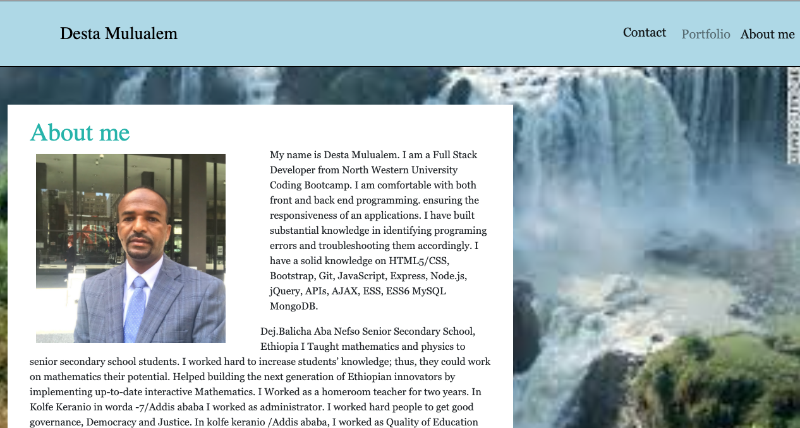
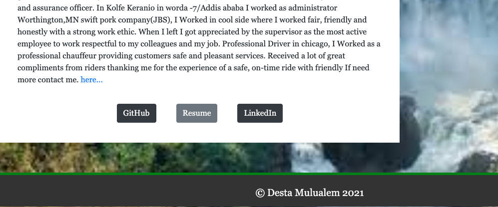
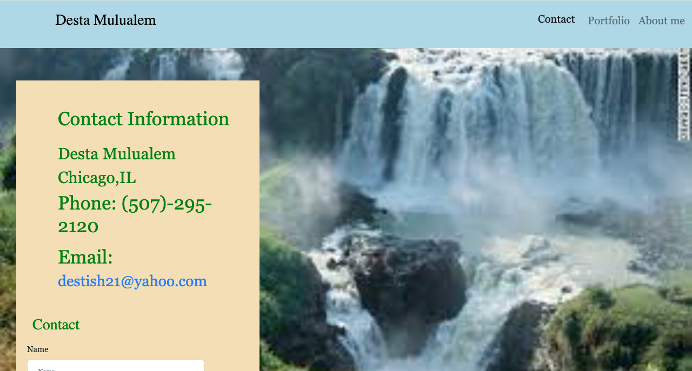
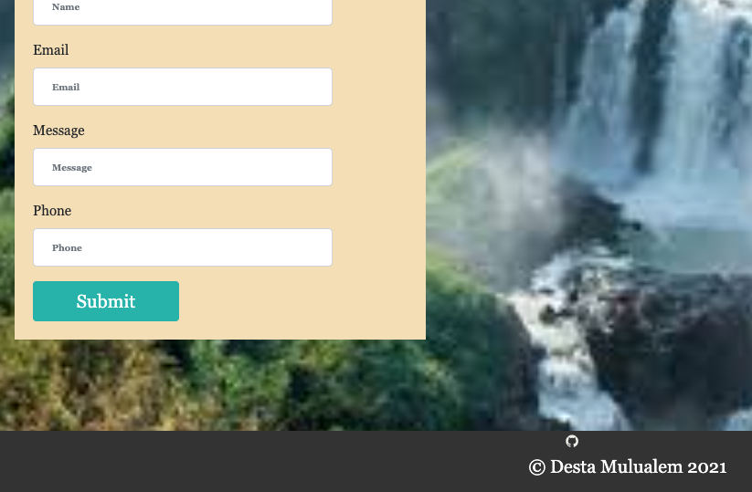
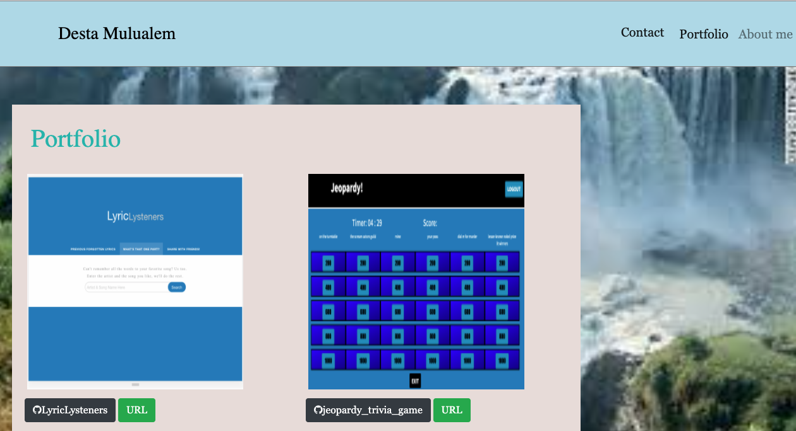
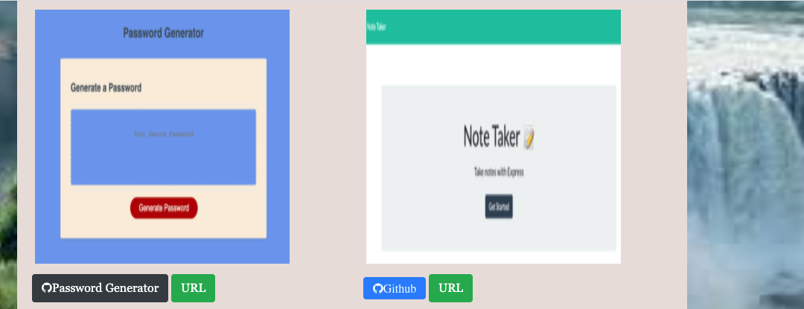
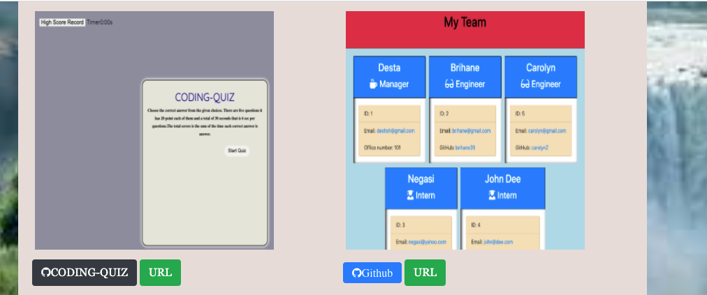
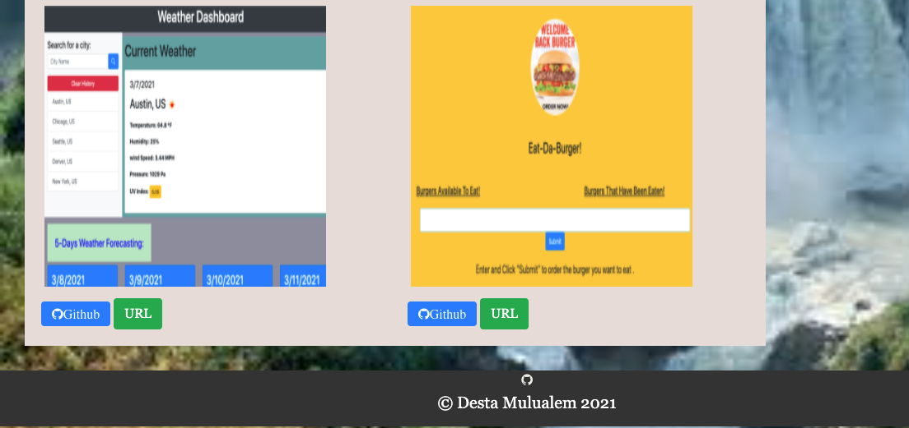

# Updated-Portfolio-2

## License
   

   # Table of Contents

   * [Description](#Description)

   * [Runing a command-line application ](#Runing-a-command-line-application) 

   * [Installation Instructions](#installation-instructions)
  
   * [Usage Instructions](#usage-instructions)
  
   * [Contribution](#Contribution)
  
   * [Developers Contact Information](#Developers-Contact-Information)

   * [License](#license)

   # Description

   * This portfolio is developed to show my projects and homeworks.
   * I used Bootstrap link to fixed navbar and as well as font awesome.min.css. 
   * In my portfolio folder I included for a project and  stand each  folders and  files
   * I explained or I wrote about the functions of each projects  and homeworks on resume explaining. 

   * I included in package.js as dependence

   * I add the javascript to be active my navbar link.

   * I attached  or linked media quiry to response my web page.

   * I use semantic syntax for adjust my index.html,contact.html, portfolio.html and styled  eachof them by styling css.

   * `Project one LyricLysteners`
   * `Project two Jeopardy`
   * `Password-Generator`
   * `apio4 CODINg-QUIZ`
   * `Note Taker`
   * `Employee-team-profile-generator`
   * `Weather-Dashboard`
   * `Burger`

   * users can quickly and easily input the a starting point for a new project they'd like to a walk-through of the portfolio.

   * I put my contact information my name, addres, phone number and email addres.

   * Acceptance Criteria.
     All my html and css is clean and brief
     Screenshot of my  projects some of my home work projectes with their github link and Deployed links attached and active.

   * I had form any body can write messege with    full information and hit submit button.
    I attached my github link, Resume link, and Linkedin link all are active.

   #  Runing a command-line application 

   * You can uses github or Deployed links.
   
   * You can View  about me all my portfolio.
 
   * You can View my projects including linkedIN.

   * The app runs as a `open one html then you can use the navbar` to see information. 

   * My Updated-Portfolio-2
   * application includes all necessary code that is readable, reliable, and maintainable   Oftentimes, .gitignore  main Readme, and screenshot images.

   * I put my LinkedIn profile, my github URL repository, heroku url and email address working activly.

   ## Installation Instructions

   * The developer is authorizing a free installation by cloning from the repository code:- 

   * [destish21/Updated-Portfolio-2](https://github.com/destish21/Updated-Portfolio-2)

   * Rihgt click on to open in index.html, contact.html, or portfoliio.html.

   # screenshot Images
   * 
   * 

   * 
   * 

   * 
   * 
   * 
   * 

   ## Usage Instructions

   * For this app to run make sure first:-

   * creat repository in your github, then clone the code from my github repository,

   * [destish21/Updated-Portfolio-2](https://github.com/destish21/Updated-Portfolio-2)

   * Make sure you are opened the files
   * Make sure the folders `Clone down`
     in your computer.

   * A `Updated-Portfolio-2`
     App !!`will be desplayed after you open it!. 

   * you can manage your portfolio easly.

   * It built with diferent folders to connect to home page  and perform requeries `links` file and return all files.

   * you can  be able to see My resume.

   * you can  be able to see My linkedIN.

   * you can  quickly access to emails and GitHub profiles.

   * My `Updated-Portfolio-2`
    is in my github repository enjoy it!
 
   ## Contribution
  
   * This is Contributed by [destish21/Updated-Portfolio-2](https://github.com/destish21/Updated-Portfolio-2). 
   
   * But Contribution, issues and feature requests are welcome.
   * Feel free to check issues page if you want to contribute. 
   * you can contact me by Contact Information here below.

   ## Developers Contact Information
   * LinkdIn Profile : [Desta Mulualem](https://www.linkedin.com/in/desta-mulualem-6718b1203/)
   * Deployed URL : https://destish21.github.io/Updated-Portfolio-2/
   * github URL :   https://destish21.github.io/Updated-Portfolio-2/
   * My ResumGoogleDocs Link: [Resume Link](https://docs.google.com/document/d/1kLc-bR0cb3ASljSuCPTRCOJI1B2KnBIMRpskvdM__WE/edit?usp=sharing)

   * Email : destish21@yahoo.com
   
   # Desta Mulualem. All Rights Reserved © 03/09/2021.
